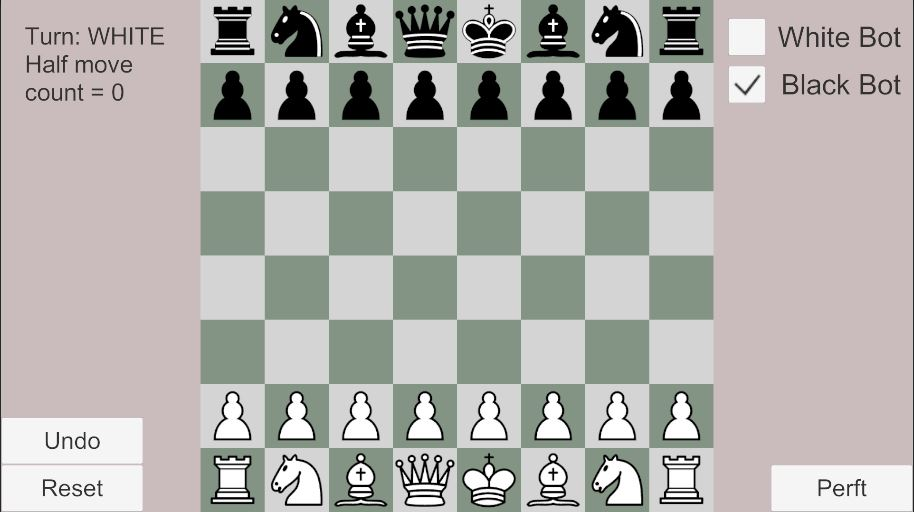
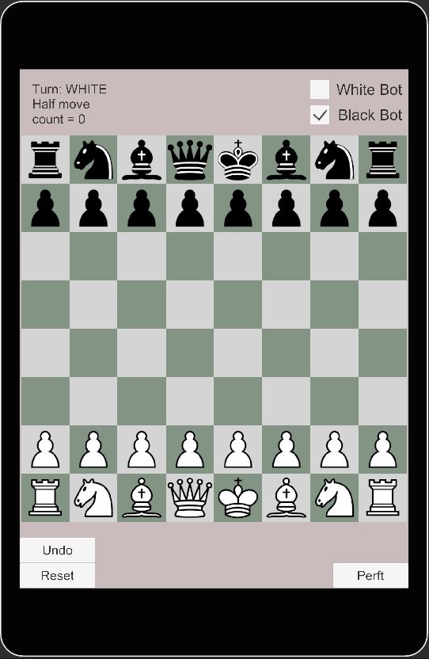
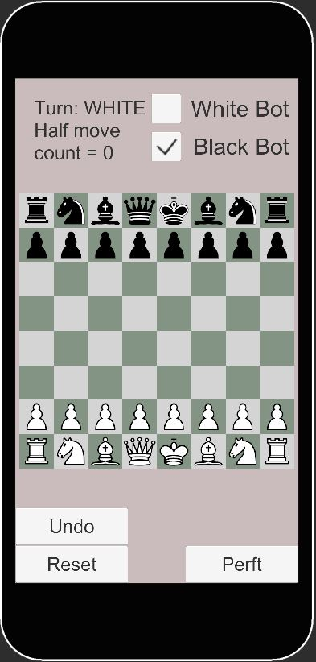
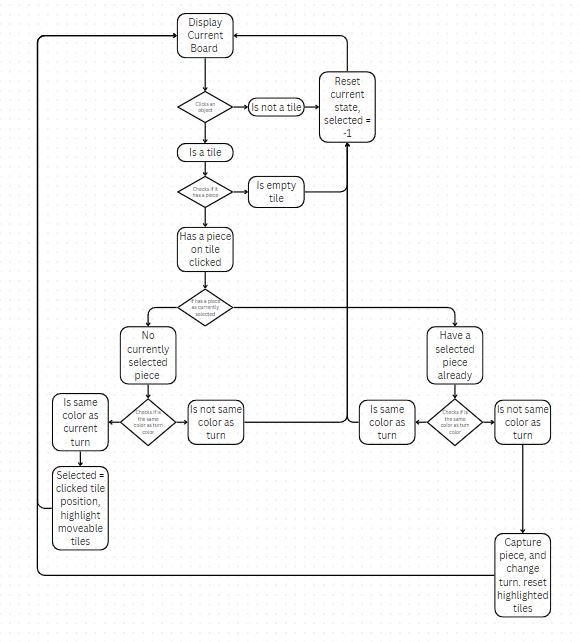
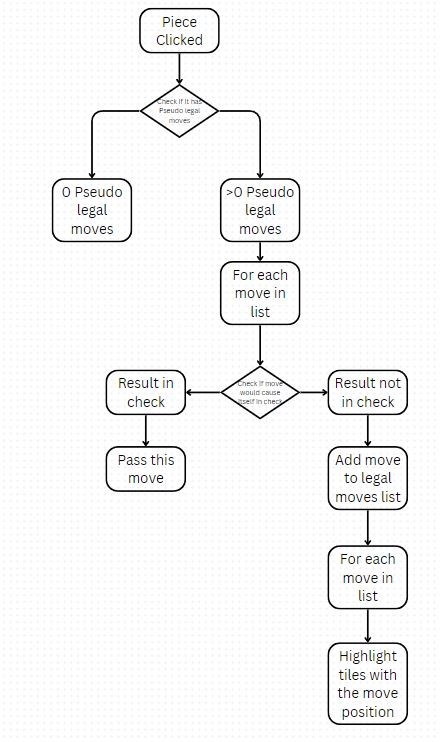
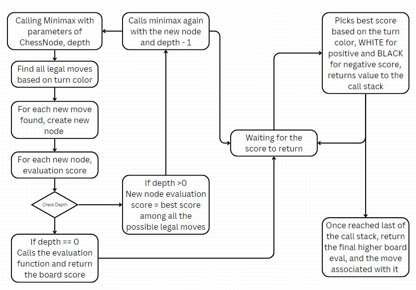
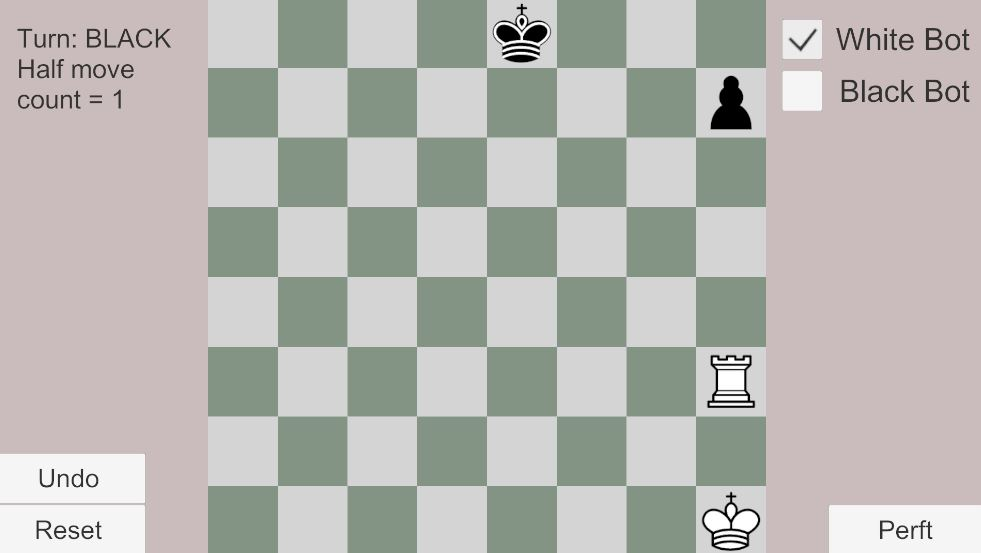

# Unity Chess Project

## Table of Contents
1. [Introduction](#introduction)
2. [Project Setup](#project-setup)
3. [Notes on Design](#notes-on-design)
4. [Testing and Debugging](#testing-and-debugging)
5. [Chess Bot Implementation](#chessbot-implementation)
6. [Conclusion and Future Improvments](#conclusion-and-future-improvements)

## Introduction
This is Unity project is my implementation of Chess. 
The display will adjust to screen size dynamically and can be played on mobile devices. 
The game initializes by parsing the FEN String representation of the board, then initialize all the game states. 
Then player can click the piece to see possible moves. 
Once the player click a valid tile to move the selected piece, the piece will either move or capture enemy piece in the destination tile. 
Once player has no valid moves, the game will end and display the winner.
All rules have been implemented and tested, including enpassant, castling, pawn capture, pawn promotion, pinning, check, stalemate and checkmate.

## Project Setup

### Requirements
- Unity 2023.2.18f1
- .NET Framework 4.7.1

### Installation
1. Clone the repository:
    ```bash
    git clone https://github.com/yourusername/unity-chess.git
    ```
2. Open the project in Unity:
    ```plaintext
    Open Unity Hub, click on "Add", and select the cloned project folder.
    ```
3. Install necessary dependencies via Unity Package Manager.

## Notes on Design

### Dynamic Display 
The app's tile size, piece size and font size are dynamically adjusted to the display size, allowing the app to be playable across different platforms displays.

- Desktop display



- Tablet screen



- Phone screen



### Board and Pieces
The chessboard is represented with a size 64 array and pieces are represented with bits. 
I used enum class for the pieces called ChessPiece with KING 6, QUEEN 5, BISHOP 4, KNIGHT 3, ROOK 2, PAWN 1.
There are also colors, BLACK 8 and WHITE 0, as well as a mask PIECE 7, and empty piece EMPTY 0
To set a piece to the bit board, you will need to use |. We will need a getPiece and getColor method to parse the bit representation

For example: 
BLACK | ROOK in bits would be 1000 | 0010, which is 1010. If you want to get piece type or color you can use &.
You can read more here: https://opensource.com/article/21/8/binary-bit-fields-masks

### Components
Follows roughly the MVC design pattern. 
The model is the game manager, which holds the game data and the bitboard.
The view is the rendered game play and UI, which is controlled display manager and UI manager components.
The controller is the moves manager component. 

The user would provide input, which is through left mouse button click.
The controller would parse the click and update the model. 
The display will be updated as the model changes.

The controller would check for all moves rules including:
- enpassant
- castling
- pawn capture
- pawn promotion
- pinning
- check
- stalemate
- checkmate
Once player has no valid moves, the game will display either stalemate or checkmate with winner.

### User Interaction Flow Charts

The following is a flowchart outlines the user interaction with the app:



The following illustrate the flow of how we determine which tile to highlight after clicking the piece:



## Testing and Debugging
Several bugs were caught during testing by comparing performance test result to the correct results at different depth. (I got the reference correct results here: https://www.chessprogramming.org/Perft_Results) 

Some notable bugs are:
- Pawn can promote when going into empty space but cannot when capturing piece.
- King can still castle after rook has been captured and switching place with the piece on the rook's tile.
- Rook move woudl remove the right to castle but capturing other piece did not remove the right to castle.
- Pawn capture enpassant opens way to a check, which is an illegal move but the legal move filter did not filter out that move(See below diagram)

Majority of the bugs are caused by when considering moving piece, moving to an empty tile and moving to another tile with enemy to capture have different logic path. When adding state change effect to the empty path, forgetting to do the same for the capture path would result in these bugs.

As for pawn enpassant capture leading to a checked king, here's a diagram for that specific case:
PERFT DEBUG OUTPUT:
NODE STEMMING FROM 37


[ ] [ ] [ ] [ ] [ ] [ ] [ ] [ ] 

[ ] [ ] [p] [ ] [ ] [ ] [ ] [ ] 

[ ] [ ] [ ] [p] [ ] [ ] [ ] [ ] 

[K] [P] [ ] [ ] [ ] [ ] [ ] [r] 

[ ] [R] [ ] [ ] [P] [p] [ ] [k] 

[ ] [ ] [ ] [ ] [ ] [ ] [ ] [ ] 

[ ] [ ] [ ] [ ] [ ] [ ] [P] [ ] 

[ ] [ ] [ ] [ ] [ ] [ ] [ ] [ ] 

Pseudo legal moves:
Ori = 37 New = 45
Ori = 37 New = 44
Filtered legal moves count for pos 37 = 2


From the output above, lower case is black piece and upper case is white piece. Top left tile pos is 0 and increase in index as it goes right and down. So the black pawn at pos 37, which is f4 in algebraic chess notation, has 2 pseudo legal moves after the white pawn at pos 36 moved two tile forward. Currently, the black pawn at pos 37 can either enpassant or move forward once. However, the final legal moves count shoudl be 1 instead of 2, since the enpassant move from pos 37 to 44 would remove the white pawn at 36, leading the white rook at pos 33 to check the black king. 

To fix this bug, I have to write a new method to check the board after moving a pseudo legal move. If the move would result in any form of check from the opponent, we will filter that out.

### Performance Testing Method
Performance test is done by a BFS method
Since all of the game state is in a class called ChessNode, we can create a queue for ChessNode, initially with the current game's node. Then pop it to find all of the movable pieces and the corresponding legal moves. That would be number of nodes can be created from current node. Make those moves into new nodes by calling moving node pieces, and then add those new nodes back to the queue for deeper depth search. 
 

## ChessBot Implementation
ChessBot is implemented with search method similar to the performance testing method, but with board evaluation added.

### Evaluation method
An int was used to represent the board trend, as in which side has a higher score. Each piece was given a score to show how valueble they are, with pawn = 10, bishop and knight = 30, rook = 50, queen = 90. For white side, all value would be positive and black the value would be negative. 

I did not assign a value for king since a king cannot be captured. So a checkmate score would be better for evaluation. 

The evaluation function would check for stalemate or checkmate, which stalemate would make the value of the board = 0 and check mate would set the score to +-10000 depending on the color.

### Minimax algorithm
The main search algorithm is basically modified performance test method. The minimax function would recursively call until reached a chess node that has endgame = true, or once the depth reaches 0. It would find all legal moves of current turn's color, create all those new nodes with legal moves and recursively go deeper to check for all of the possible nodes. Once reaching the end node, it will evaluate the board and give a score and return to the higher level. Among all the child nodes scores returned, it would pick the highest score node based on the turn color. At the original call method, we will set the next move as the move that lead to the best score.



### Alpha-Beta Pruning
Alpha-beta pruning optimizes the minimax algorithm by reducing the number of nodes evaluated in the search tree, enhancing efficiency. It introduces two variables: alpha (the best score that the maximizing player can guarantee) and beta (the best score that the minimizing player can guarantee). As the algorithm recursively explores the game tree, it updates alpha and beta values, which will used to judge if the node would be worth to dig deeper or not. If a move results in a score worse than a previously examined move (beta <= alpha), further exploration of that branch is stopped since we already know if not worth. Integrating alpha-beta pruning into the ChessBot involves modifying the minimax function to include these alpha and beta checks. This allows the ChessBot to make quicker and deeper evaluations, ensuring optimal and efficient move decisions.

### Issues with ChessBots
Several issues with the current chess bot implementation:
- For higher depth search, the search time is way too long for a realistic chess game. So depth has to be set pretty low
- Early game with repeated, predictable moves. This is due to all of the nodes would return a same value. So the search method would only set to the first move that yielded the same value.
- Will wait to take a piece until have to. This is still due to the same value returned on all node. 



In here you can see that white is controlled by bot. The reasonable move would be capturing the pawn next move. However if I move the king 1 tile down, the rook would move 1 tile up. Since that is the first tile it search during minimax function. All of the tiles moving up or the tile moving down would eventually lead to capture, which is the same score. So all of the moves are equal in board evaluation. Once I move my king one tile right, then the bot would capture the pawn, since if it doesn't, the pawn will be protected. Thus all of the empty tiles above and below of the rook will have a lower score than the tile has black pawn. 

To solve this issue, I have added a line to evaluate the current board and compare it to the child board. If it's the same, return the value+1 for white, -1 for black, so that it has a priority compare to other nodes if everything eventually come out to be the same.

## Conclusion and Future improvements
In this project, I have achieved:
- Develop a functional, interactive and accurate chess app with 2 players or 1 player mode
- Implementing performance test function to ensure the correctness of the move rules implementation
- Basic chess bot with board evaluation and search function
- Pretty strong late game when looking for a few steps to check mate

Things I'm not so happy about:
- Long search time with higher depth search
- Repeated bot moves when it does not know which move is better
- Very weak early and middle game

To improve on these issues, I will need to:
- Improve the data structure to smaller data types  
- Optimize search function efficiency
- Having transposition table and prioritize move orders during search
